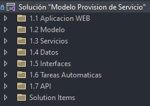

# Developer Guide - Provisión de servicios


!Bienvenido a la guía para el desarrollador del aplicativo de Provisión de servicios!

Esta guía ha sido diseñada para ayudarte a entender mejor el funcionamiento del aplicativo web "Provisión de servicios" y proporcionarte una visión general de las tareas que debes realizar para mantenerlo y mejorarlo.


## ¿Qué es Provisión de servicios?

Provisión de servicios es un aplicativo web desarollado a la medida por ISES para la empresa Afinia, el cual tiene el objetivo de gestionar las solicitudes de vinculación de nuevos clientes al servicio de energía.
## Installation

Una vez vinculado al equipo de GitLab, clonar el proyecto preferiblemente en la raíz de tu disco principal.

```bash
  git clone https://gitlab.com/desarrollo-externo-afinia/provision-de-servicio.git
  cd provision-de-servicio
```


    
## 🛠 Tecnologías utilizadas
Provisión de servicios está construído sobre una arquitectura MVC y utiliza herramientas y tecnologías como
C#, .NET Core, Razor, Entity Framework, Microsoft Identity, RestCharp, HTML, CSS, JavaScript, Microsoft SQL Server, Bootstrap, Materialize, etc...


## Estructura

La solución del aplicativo de procisión de servicios cuenta con 7 carpetas principales de solución.



- **1.1 Aplicación WEB:**
    En esta carpeta está la estructura de archivos de aplicación web MVC ASP.NET, en ella se incluyen los controladores, las vistas, scripts, y diferentes librerías instaladas de forma local en la carpeta wwwroot. Además de esto, en la carpeta "Areas" se encuentran todas las vistas y archivos .cshtml.cs generados por el scafolding de Indentity, la cual es una API con la que el aplicativo maneja la funcionalidad de inicio de sesión y todo lo referente a la autenticación y autorización dentro del aplicativo.

- **1.2 Modelo:**
    En esta carpeta están almacenadas todas las clases utilizadas para identificar los objetos utilizados en el funcionamiento del aplicativo. Cada clase de la carpeta "Models" hace referencia a una tabla de la base de datos, es decir, cada modelo debe ser un mapeo exacto de los campos de la tabla correspondiente en la base de datos. Existe una exepción de modelos dentro de esta carpeta, la cual se encuentra en la subcarpeta "ViewModels", allí se encuentran clases o modelos que pueden ser resultantes de determinadas consultas que involucren a más de una tabla o combinen en su resultado campos de distintas tablas, esta estructura no es estricta y puede ser personalizada según lo que se necesite a nivel de desarrollo.

- **1.3 Servicios:**
    En esta carpeta se incluyen todos los archivos que manejan lo referente a la lógica de negocios (Metodos, flujos, consultas, etc) del aplicativo. Generalmente, se tiene un "Service" por cada modelo, pero esto no es estricto y se pueden llegar a encontrar casos donde no se requiera crear un servicio junto con un modelo creado anteriormente.

- **1.4 Datos:**
    Aquí se encuentra alojado el "ApplicationDbContext" o contexto de la base de datos del aplicativo. Este archivo es utilizado por Entity Framework para definir la estructura del contexto de la base de datos. En el se encuentra todo el código y lógica necesaria para incluir elementos de la base de datos, ya sea Tablas, Triggers, Stored Procedures, etc. Cabe resaltar que toda tabla que se desee consultar a nivel de código debe estar mapeada dentro de este archivo.

- **1.5 Interfaces:**
    En esta carpeta solo se encuentra una interfaz, y es la clase "IEmailSender" la cual posibilita el envío de correos electronicos desde la aplicación.

- **1.6 Tareas Automaticas:**
    Estructura de biblioteca de clases la cual solo tiene un archivo (Program.cs), en este archivo hay varios metodos, los cuales ejecutan tareas de forma automatica. Estás tareas se ejecutan cada cierto periodo determinado, el cual se define desde el servidor.

- **1.7 API:**
    En esta carpeta de solución está almacenado un proyecto API Rest el cual se encarga de integrar funcionalidades de OPEN SGC (sistema externo utilizado por el equipo Afinia) para la creación de expedientes en el aplicativo de provisión de servicios.


## Más información y utilidades

#### Soportes:

 - [Redirección de ID's](./soportes/redireccionar-id.md)
 - [Deuda inexistente](./soportes/deuda-inexistente.md)
 - [Solicitudes por usuario](./soportes/solicitudes-por-usuario.md)

 #### Consultas:

 - [Municipios de una territorial](./consultas/municipios-territorial.md)
 - [Detalle de cargas](./consultas/detalle-cargas.md)
 - [Solicitud, solicitante, y estado actual](./consultas/solicitud-solicitante-estado.md)


