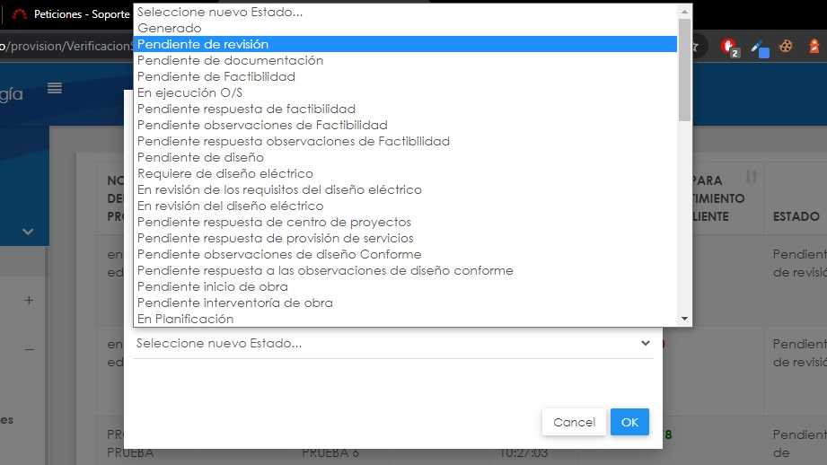

# Soporte de deuda inexistente

Este soporte trata de la inexistencia de un registro asociado a una solicitud especifica en la tabla PS.Deuda. Para solucionarlo, debes dirigirte a SQL Server Management Studio y seguri los siguientes pasos:


### Pasos a seguir:

1. Buscar deuda en "PS.Deuda" con el ID suministrado en la plataforma Redmine. Tomemos como ejemplo el ID 00234

```bash
  SELECT EstadoId, * FROM PS.Deuda WHERE SolicitudId IN(00234)
```

2. Cambiar el estado de la solicitud desde provisión de servicios a "Pendiente de revisión" y abrir la modal de verificación de requisitos para ver las observaciones.



3. Una vez se tenga la información de la deuda según las observaciones, proceder a hacer la inserción en la tabla de deuda.

⚠ (Ser cuidadoso a la hora de ejecutar el comando, reemplaza los valores de la consulta con la información obtenida en el paso 2)

```bash
  INSERT INTO PS.Deuda (SolicitudId, NIC, Valor, Observacion, EstadoId) VALUES (18266, '1099248', 125850, 'se encuentra Nic 1099248 con  deuda $125.850.', 00234)
```

4. Actualizar la solicitud para volver a tenerla en el estado pendiente de deuda y dejar que el usuario gestione el comprobante o acuerdo de pago.

⚠ (Ser cuidadoso a la hora de ejecutar el comando, reemplaza los valores del comando con el ID correspondiente)

```bash
  UPDATE PS.Solicitud SET EstadoId = 1063 WHERE SolicitudId = 00234)
```

5. Buscar el historial de estados de la solicitud que fue cambiada. (_Reemplazar el valor de SolicitudId por el ID que se está trabajando_)

```bash
  SELECT * FROM PS.HistorialEstado WHERE SolicitudId = 00234
```

6. Copiar el último HistorialEstadoId registrado según la FechaSistema en el resultado de la consulta.

7. Reemplazar el HistorialEstadoId en el WHERE de la sentencia DELETE (Tener mucho cuidado ⚠)

```bash
  DELETE FROM PS.HistorialEstado WHERE HistorialEstadoId = 00234
```

Luego de seguir estos pasos, la deuda ya existe en la base de datos y el error no debería persistir, así como tampoco deberían quedar registros inusuales en el historial de estados de la solicitud.

Es importante recordar que todas estas sentencias se ejecutarán en producción, así que nuevamente reitero TENER MUCHO CUIDADO ⚠

#### Casos especiales:

Puede que la deuda si esté registrada pero el valor es atípico, por ejemplo: en las observaciones de los rquisitos dice que tiene deuda por $961.000, pero en el registro de la tabla PS.Deuda el valor es 961.

En este caso, ejecutar la sentencia UPDATE necesaria para corregir el dato:

```bash
  UPDATE PS.Deuda SET Valor = 961000 WHERE DeudaId = 00234
```