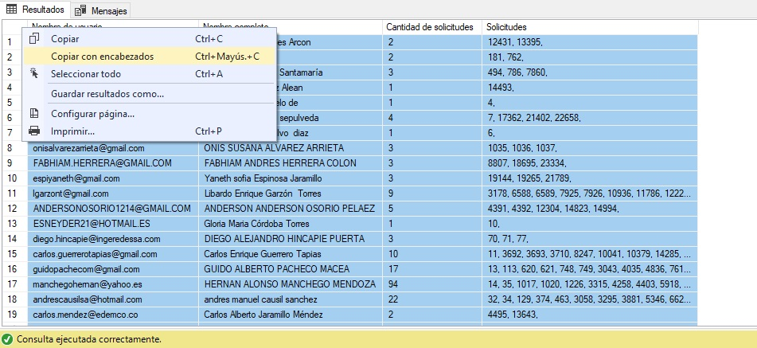

# Petiticón de informe de solicitudes por usuario

Ocasionalmente el cliente requiere saber cuantos y cuales ID's tiene cada usuario del aplicativo, para obtener esta información debemos ejecutar la siguiente consulta:

```bash
  SELECT
u.UserName AS 'Nombre de usuario',
CONCAT(p.PrimerNombre, ' ', p.SegundoNombre, ' ', p.PrimerApellido, ' ', p.SegundoApellido) AS 'Nombre completo',
(SELECT COUNT(SolicitudId) FROM PS.Solicitud sub WHERE sub.UsuarioId = u.UsuarioId and sub.Eliminado = 0) AS 'Cantidad de solicitudes',
(
	SELECT 
	CONCAT(sub.SolicitudId, ', ')
	FROM PS.Solicitud sub WHERE sub.UsuarioId = u.UsuarioId AND sub.Eliminado = 0 FOR XML PATH ('')
) AS Solicitudes
FROM PS.Usuario u
JOIN PS.Solicitud s ON u.UsuarioId = s.UsuarioId
JOIN PS.Persona p ON u.Persona_IdPersona = p.PersonaId
WHERE u.Eliminado = 0 AND s.Eliminado = 0
GROUP BY u.UsuarioId, u.UserName, p.PrimerNombre, p.SegundoNombre, p.PrimerApellido, p.SegundoApellido
```

Luego de obtener esta información se debe copiar la información obtenida en formato tabla desde SQL Server Management Studio.



Después de hacerlo, el último paso es pegar en excel, dar presentación y formato, y entregar el informe por medio de Redmine.
